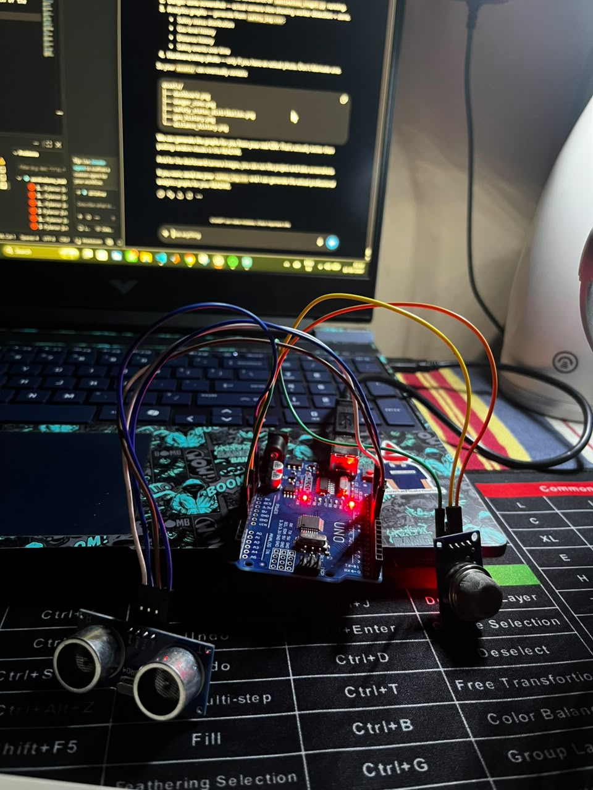

Okay bro — don't worry about the color now. We need one definitive check.

Run exactly:

git status --porcelain=v1

It will produce lines like:

 M README.md
A  assets/worker_detection_test_cases.png

The two characters at the beginning matter:

M → README not staged
M → README staged ✅
A → asset staged ✅
?? → file not staged/untracked
If you get M README.md

Run:

git add -- README.md

Then immediately:

git status --porcelain=v1

Paste that complete output here. Don't commit yet.

We are going to get this sorted without touching your actual files. 👍

leave i bro manually icant change from gihutb ?

Yes bro 😄 — you can absolutely add the files manually through GitHub's website. If Git is giving you a headache, that's a perfectly fine workaround.

From GitHub website
Open your repository on GitHub.
Click Add file → Upload files.
Drag your assets folder/files into the upload area.
Make sure these files appear:
distance_test_cases.png
documented_test_cases.csv
gas_test_cases.png
hardware_setup.jpg
safety_status_test_cases.png
worker_detection_test_cases.png
Scroll down to Commit changes.
Enter something like:
Add project test assets
Click Commit changes.
For README

You can also edit README.md directly on GitHub:

README.md → pencil ✏️ → make your changes → Commit changes

So yes — you don't need to fight the terminal anymore. 😂

One thing, though: if your local README has important changes that aren't on GitHub yet, make sure you copy those changes to the GitHub README before committing the web version.

Pasted markdown(1).md
File
8feac7dd-d626-4ca5-b8fb-9919b9adb9ab.zip
Zip Archive
in radme generate the image from second zip for hardware connections graph and rest all keeping same generate me the new readme
dont generate image generate me new read me

Done bro. I kept the README the same everywhere else and changed only the Hardware section to use the hardware_setup.jpg from your second ZIP as the hardware-connections visual.

Download the new README.md

The image reference is:

So when you upload README.md and assets/hardware_setup.jpg to GitHub, the image will render automatically. 

README_new.md
Document

SentinelOne Industrial
Factory Worker Safety Monitoring System

SentinelOne Industrial is a real-time industrial safety monitoring prototype that combines embedded sensors, Arduino, computer vision, YOLO-based worker detection, danger-zone monitoring, and safety-event analytics into a unified monitoring system.

The system continuously combines environmental sensor data with visual information from a webcam to determine whether the monitored environment is SAFE, WARNING, or DANGER.

Project Status: Functional prototype / completed development project

🏗️ System Architecture
                         SENTINELONE INDUSTRIAL
                    FACTORY WORKER SAFETY MONITOR
                                 │
                ┌────────────────┴────────────────┐
                │                                 │
                ▼                                 ▼
         ┌───────────────┐                 ┌───────────────┐
         │  ARDUINO UNO  │                 │    WEBCAM     │
         └───────┬───────┘                 └───────┬───────┘
                 │                                 │
        ┌────────┴────────┐                        ▼
        │                 │                ┌────────────────┐
        ▼                 ▼                │ YOLO11n Model  │
 ┌─────────────┐   ┌─────────────┐        │ Person/Worker  │
 │ Gas Sensor  │   │   HC-SR04   │        │   Detection    │
 │ MQ-Series   │   │ Ultrasonic  │        └───────┬────────┘
 └──────┬──────┘   └──────┬──────┘                │
        │                 │                        │
        └────────┬────────┘                        │
                 │                                 │
                 └──────────────┬──────────────────┘
                                ▼
                    ┌─────────────────────────┐
                    │    PYTHON APPLICATION   │
                    │                         │
                    │   Safety Decision       │
                    │       Engine             │
                    └────────────┬────────────┘
                                 │
                    ┌────────────┼────────────┐
                    │            │            │
                    ▼            ▼            ▼
              ┌──────────┐ ┌──────────┐ ┌──────────────┐
              │   Gas    │ │Distance  │ │ Danger Zone  │
              │ Analysis │ │ Analysis │ │   Analysis   │
              └────┬─────┘ └────┬─────┘ └──────┬───────┘
                   │            │               │
                   └────────────┼───────────────┘
                                ▼
                    ┌─────────────────────────┐
                    │    SAFETY CLASSIFIER    │
                    │                         │
                    │ SAFE / WARNING / DANGER │
                    └────────────┬────────────┘
                                 │
                     ┌───────────┴───────────┐
                     │                       │
                     ▼                       ▼
              ┌──────────────┐       ┌────────────────┐
              │ LIVE         │       │ EVENT LOGGER   │
              │ DASHBOARD    │       │ safety_log.csv │
              └──────────────┘       └───────┬────────┘
                                             │
                                             ▼
                                    ┌──────────────────┐
                                    │ EVENT HISTORY /  │
                                    │    ANALYTICS     │
                                    └──────────────────┘
📁 Project Structure
SentinelOne-Industrial/
│
├── README.md
├── .gitignore
├── requirements.txt
│
├── sentinelone_stage5.py
├── sentinelone_serial.py
├── sentinelone_analytics.py
├── sentinelone_main_yolo_zone_stage3.py
│
├── worker_detection.py
├── worker_detection_yolo.py
│
├── yolo11n.pt
├── safety_log.csv
│
├── archive/
│   └── Previous development versions
│
├── docs/
│   ├── SETUP.md
│   ├── testing.md
│   └── safety_logic.md
│
├── sketch_aug13a/
│   └── Arduino sketch files
│
└── assets/
    ├── dashboard.png
    ├── worker_detection.png
    ├── danger_zone.png
    ├── analytics.png
    └── system_setup.png
Main Components
Component	Purpose
sentinelone_stage5.py	Final real-time safety monitoring application
sentinelone_serial.py	Arduino-to-Python serial communication
sentinelone_analytics.py	Safety-event analytics
sentinelone_main_yolo_zone_stage3.py	Previous development implementation
worker_detection.py	Worker-detection utilities
worker_detection_yolo.py	YOLO-based person detection
yolo11n.pt	YOLO11n model weights
safety_log.csv	Recorded safety events
requirements.txt	Python dependencies
archive/	Previous development versions
docs/	Project documentation
sketch_aug13a/	Arduino project/sketch files
assets/	Project screenshots, dashboard images, and analytics visuals

Note: sentinelone_stage5.py is the final active implementation. Earlier development versions are retained for project history and reference.

⚙️ How It Works

The monitoring pipeline operates continuously:

1. Arduino reads environmental sensors
              ↓
2. Arduino sends sensor data through serial communication
              ↓
3. Python receives gas and distance readings
              ↓
4. Webcam captures the monitoring area
              ↓
5. YOLO11n detects people
              ↓
6. Worker positions are evaluated against the danger zone
              ↓
7. Gas, distance and zone conditions are evaluated
              ↓
8. Safety engine determines SAFE / WARNING / DANGER
              ↓
9. Live dashboard displays the current condition
              ↓
10. Safety events are logged when status/reason changes
              ↓
11. Recent safety events remain visible in the dashboard
              ↓
12. Recorded events can be analyzed through analytics
👷 Computer Vision & Worker Detection

SentinelOne Industrial uses YOLO11n through the Ultralytics framework for real-time person detection.

The final implementation:

Captures webcam frames using OpenCV.
Runs YOLO inference every second frame.
Uses a confidence threshold of 0.45.
Filters detections to the COCO person class.
Counts detected workers.
Uses detected worker positions for danger-zone evaluation.
Retains the latest valid detections between inference frames for smoother dashboard operation.
Keeps bounding-box coordinates within the active camera frame.
🚧 Danger-Zone Detection

A configurable rectangular danger zone is defined relative to the camera frame.

              CAMERA FRAME
┌──────────────────────────────────────┐
│                                      │
│              SAFE AREA               │
│                                      │
│       ┌──────────────────────┐       │
│       │                      │       │
│       │     DANGER ZONE      │       │
│       │                      │       │
│       │        👷            │       │
│       │                      │       │
│       └──────────────────────┘       │
│                                      │
└──────────────────────────────────────┘

The final implementation uses normalized coordinates:

DANGER_ZONE_X1 = 0.25
DANGER_ZONE_Y1 = 0.45
DANGER_ZONE_X2 = 0.80
DANGER_ZONE_Y2 = 1.00

This allows the danger zone to scale with the active camera resolution.

Worker Zone Evaluation

The lower-center point of a worker's bounding box is used as an approximation of the worker's standing position.

A small detection margin is also applied to reduce unwanted status changes caused by bounding-box movement near the zone boundary.

When a worker enters the configured danger zone:

ZONE = INTRUSION
STATUS = DANGER
REASON = DANGER ZONE INTRUSION
🛡️ Safety Classification

The safety engine evaluates three primary conditions:

Gas level
Ultrasonic distance
Worker danger-zone intrusion
SAFE

All monitored conditions remain within the configured normal operating range.

WARNING

A monitored parameter crosses its warning threshold but does not reach the configured danger condition.

DANGER

A critical condition is detected.

Examples:

Worker enters the configured danger zone
Gas exceeds the danger threshold
Distance reaches the danger threshold

Danger-zone intrusion is treated as an immediate danger condition.

📏 Distance Monitoring

The HC-SR04 ultrasonic sensor provides distance information to the Arduino.

The Python application receives the distance through serial communication.

Condition	Threshold
🟠 WARNING	≤ 20 cm
🔴 DANGER	≤ 10 cm

These values are project-specific configuration values and can be changed in the Python application.

🌫️ Gas Monitoring

The system receives gas-level readings from the Arduino-based sensing subsystem.

The gas value is transmitted to Python through serial communication and incorporated into the safety decision engine.

Condition	Gas Level
🟠 WARNING	> 70
🔴 DANGER	> 150

These are prototype software thresholds, not certified occupational exposure limits.

GAS_WARNING = 70
GAS_DANGER = 150
🔌 Arduino Communication

The Arduino communicates with the Python application using serial communication.

Current configuration:

Serial Port : COM3
Baud Rate   : 9600

Example Arduino message:

Gas: 82 | Distance: 17.50

Note: The COM port may be different on another computer. Update ARDUINO_PORT when required.

🖥️ Real-Time Dashboard

The final application provides a live OpenCV monitoring dashboard.

The dashboard displays:

Gas level
Distance
Workers detected
Danger-zone status
Safety status
System operational state
Monitoring state
Recent safety events
Event reason
Exit instruction
Live Dashboard

📸 System Demonstration

This section provides visual evidence of the working monitoring system.

🎥 Camera & Worker Detection

The webcam feed is processed using YOLO11n to identify people in the monitored area.

The detection pipeline provides:

Worker count
Bounding-box coordinates
Worker position
Danger-zone evaluation
🚧 Danger-Zone Intrusion

When the detected worker enters the configured danger zone, the safety engine immediately changes the system state to DANGER.

Expected state:

ZONE   : INTRUSION
STATUS : DANGER
REASON : DANGER ZONE INTRUSION
🟢 Normal Safe Operation

A normal operating condition can be represented by:

Gas      : 31
Distance : 233.96 cm
Workers  : 0
Zone     : CLEAR
Status   : SAFE
Reason   : NORMAL

🔴 Danger Monitoring State

A danger condition can be represented by:

Gas      : 31
Distance : 233.96 cm
Workers  : 1
Zone     : INTRUSION
Status   : DANGER
Reason   : DANGER ZONE INTRUSION

📊 Safety Analytics

Recorded safety events are stored in:

safety_log.csv

The analytics component can be used to analyze:

Total recorded events
SAFE events
WARNING events
DANGER events
Average gas level
Average distance
Worker detection statistics
Gas history
Distance history
Safety-status distribution
Safety-event trends
Analytics Visualization

The analytics pipeline converts recorded safety events into useful historical information and visual trends.

Real-Time Monitoring
        ↓
Safety Decision Engine
        ↓
Safety Events
        ↓
safety_log.csv
        ↓
Analytics
        ↓
Statistics + Trends + Graphs
📋 Safety Event Logging

Safety events are stored in:

safety_log.csv

The logging system records:

Field	Description
Timestamp	Time of the event
Gas Level	Current gas reading
Distance (cm)	Current ultrasonic distance
Workers	Number of detected workers
Safety Status	SAFE / WARNING / DANGER
Event Reason	Cause of the current safety state

Example:

Timestamp,Gas Level,Distance (cm),Workers,Safety Status,Event Reason
2026-08-16 01:10:10,31,233.96,1,DANGER,DANGER ZONE INTRUSION
Event-Based Logging

The system does not write an identical event to the CSV on every video frame.

A new event is logged when the safety status or event reason changes.

SAFE
  ↓
DANGER ZONE INTRUSION
  ↓
DANGER

This keeps the safety log useful and prevents unnecessary duplicate records.

🕒 Recent Safety Events

The final Stage 5 implementation maintains a compact history of recent safety events.

The dashboard displays:

Event time
Safety status
Event reason

Example:

RECENT SAFETY EVENTS

01:10:10  DANGER
DANGER ZONE INTRUSION

01:09:42  SAFE
NORMAL

The application also loads recent valid events from safety_log.csv when the system starts.

🔧 Hardware
Prototype Hardware
Arduino Uno
MQ-series gas sensor
HC-SR04 ultrasonic distance sensor
USB connection
Computer/laptop
Webcam
Hardware Flow
MQ Gas Sensor ─────┐
                   │
                   ▼
               Arduino UNO
                   │
HC-SR04 ───────────┘
                   │
                   │ USB / Serial
                   ▼
              Python Application
                   │
                   ▼
              Safety Engine
                   │
                   ▼
              Live Dashboard
💻 Software Stack
Component	Technology
Programming	Python
Embedded Controller	Arduino Uno
Computer Vision	OpenCV
Object Detection	YOLO11n
YOLO Framework	Ultralytics
Serial Communication	PySerial
Data Processing	Pandas
Visualization	Matplotlib
Logging	CSV
Dashboard	OpenCV
🚀 Installation
1. Clone the Repository
git clone https://github.com/meghkademani/SentinelOne-Industrial.git
cd SentinelOne-Industrial
2. Create a Python Virtual Environment
python -m venv .venv

Activate the environment:

.\.venv\Scripts\Activate.ps1
3. Install Dependencies
pip install -r requirements.txt
🔌 Hardware Setup
Connect the Arduino Uno to the computer.
Connect the gas sensor.
Connect the HC-SR04 ultrasonic sensor.
Connect the webcam.
Upload the Arduino sketch.
Confirm the Arduino COM port.
Update the Python serial-port configuration if required.

Current configuration:

ARDUINO_PORT = "COM3"
BAUD_RATE = 9600
▶️ Running the System

The final monitoring application is:

sentinelone_stage5.py

Run it with:

python sentinelone_stage5.py

The application will:

Connect to Arduino
       ↓
Start webcam
       ↓
Load YOLO11n
       ↓
Read sensor data
       ↓
Detect workers
       ↓
Evaluate danger zone
       ↓
Calculate safety status
       ↓
Display live dashboard
       ↓
Record safety events
       ↓
Display recent event history

Press:

Q

to stop the monitoring application.

During shutdown, the application releases the webcam, closes the Arduino serial connection, and closes OpenCV windows.

⚙️ Configuration

Important configuration values are located in:

sentinelone_stage5.py
Serial Communication
ARDUINO_PORT = "COM3"
BAUD_RATE = 9600
Gas Thresholds
GAS_WARNING = 70
GAS_DANGER = 150
Distance Thresholds
DISTANCE_WARNING = 20
DISTANCE_DANGER = 10
YOLO Processing
YOLO_EVERY_N_FRAMES = 2
Danger Zone
DANGER_ZONE_X1 = 0.25
DANGER_ZONE_Y1 = 0.45
DANGER_ZONE_X2 = 0.80
DANGER_ZONE_Y2 = 1.00
Detection Margin
ZONE_DETECTION_MARGIN = 12
🧠 Safety Decision Logic

The final safety engine follows this priority:

                 SENSOR + VISION DATA
                          │
          ┌───────────────┼───────────────┐
          │               │               │
          ▼               ▼               ▼
       Gas Level       Distance      Worker Zone
          │               │               │
          └───────────────┼───────────────┘
                          │
                          ▼
                   SAFETY ENGINE
                          │
             ┌────────────┼────────────┐
             │            │            │
             ▼            ▼            ▼
           SAFE        WARNING       DANGER

Conceptually:

IF worker enters danger zone
        → DANGER

ELSE IF gas > danger threshold
        → DANGER

ELSE IF distance <= danger threshold
        → DANGER

ELSE IF gas > warning threshold
        → WARNING

ELSE IF distance <= warning threshold
        → WARNING

ELSE
        → SAFE

Possible event reasons include:

NORMAL
GAS WARNING
GAS LEVEL
PROXIMITY WARNING
PROXIMITY
GAS + PROXIMITY WARNING
GAS + PROXIMITY
DANGER ZONE INTRUSION
📈 Data & Analytics Pipeline
                 REAL-TIME MONITORING
                         │
                         ▼
                ┌─────────────────┐
                │ Safety Decision │
                └────────┬────────┘
                         │
                         ▼
                  Safety Events
                         │
                         ▼
                   safety_log.csv
                         │
                         ▼
                History / Analytics
                         │
              ┌──────────┼──────────┐
              │          │          │
              ▼          ▼          ▼
          Statistics   Trends     Graphs
🔬 Technical Highlights
Multi-Modal Monitoring

The system combines environmental sensing and computer vision to evaluate industrial safety conditions.

Real-Time Processing

Arduino sensor readings and webcam frames are processed continuously while the application is running.

YOLO-Based Worker Detection

YOLO11n is used to detect people in the camera view and provide worker counts and positions.

Configurable Danger Zone

The danger zone uses normalized frame coordinates, allowing it to adapt to different camera resolutions.

YOLO Inference Optimization

YOLO inference is performed every second frame while the latest valid detections are retained between inference frames. This reduces computational load and improves dashboard responsiveness.

Event-Based Logging

The application records safety events when the safety status or event reason changes rather than continuously duplicating identical states.

Event History

Recent safety events are loaded from the CSV log and displayed directly on the monitoring dashboard.

Analytics

Recorded events can be processed to generate historical statistics, trends, and graphs.

Integrated Safety Decision Engine

Sensor and vision conditions are combined into a unified:

SAFE
WARNING
DANGER

classification.

🧪 Testing

The final implementation was tested using the connected Arduino, ultrasonic distance sensor, gas sensor, webcam, and YOLO-based worker detection system.

Normal Operation
Gas: 31
Distance: 233.96 cm
Workers: 0
Zone: CLEAR
Status: SAFE
Reason: NORMAL
Danger-Zone Testing
Gas: 31
Distance: 233.96 cm
Workers: 1
Zone: INTRUSION
Status: DANGER
Reason: DANGER ZONE INTRUSION

The corresponding safety event was written to:

safety_log.csv

and displayed through the recent-event history.

Detailed setup and testing information is available in:

docs/SETUP.md
docs/testing.md
docs/safety_logic.md
🗂️ Development History

The project was developed incrementally through multiple implementation stages.

Earlier versions are retained for development history and reference.

The current final implementation is:

sentinelone_stage5.py

Previous implementations are kept separately where appropriate.

🚧 Future Improvements

The current prototype is considered complete for the project's intended scope.

Possible future research directions include:

Multi-camera monitoring

Web-based monitoring dashboard

Email/SMS/notification alerts

Improved worker tracking

Advanced danger-zone management

Database-backed event storage

Remote monitoring

Hardware alarm integration

Improved sensor calibration

Edge-device model optimization

Automated report generation

These are future possibilities, not requirements for the current completed prototype.

⚠️ Limitations

SentinelOne Industrial is a prototype and has several limitations:

Gas readings depend on the connected sensor and its calibration.
Distance measurements depend on HC-SR04 installation and environmental conditions.
YOLO detection performance depends on camera quality, lighting, positioning, and scene conditions.
Camera-based danger-zone detection depends on the camera viewpoint.
The configured thresholds are project-specific prototype values.
The system has not been certified as an industrial safety control system.
The system should not be treated as a replacement for certified industrial safety equipment.
🛑 Safety Disclaimer

SentinelOne Industrial is an educational and engineering prototype.

It is not a certified industrial safety system and must not be used as a replacement for professionally certified safety equipment, emergency systems, industrial controls, risk assessments, or trained safety personnel.

The threshold values and detection logic demonstrated in this repository are intended for experimentation, learning, and development.

🎯 Project Goal

The goal of SentinelOne Industrial is to demonstrate how embedded systems, environmental sensing, computer vision, real-time processing, safety decision logic, and event analytics can be combined into a unified industrial safety-monitoring prototype.

Embedded Sensing
       +
Computer Vision
       +
Real-Time Processing
       +
Safety Decision Logic
       +
Event Logging
       +
Analytics
       =
Integrated Safety Monitoring Prototype
👤 Project
SentinelOne Industrial

Factory Worker Safety Monitoring System

An engineering prototype exploring the integration of:

Arduino
   +
Environmental Sensors
   +
Python
   +
OpenCV
   +
YOLO11n
   +
Safety Decision Engine
   +
Event Logging
   +
Analytics
⭐ If You Find This Project Interesting

Consider starring the repository and following the project.

SentinelOne Industrial — From sensing to vision, from detection to decision.

Close
